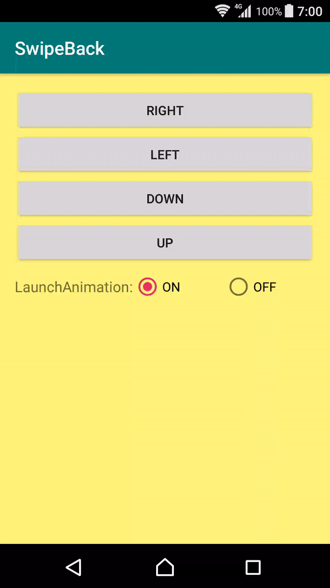

# SwipeBack<a href='https://play.google.com/store/apps/details?id=com.yangpingapps.swipeback'></a>

Use the swipe gesture with four directions(right, left, down, up) to finish the activity.


Demo
======




Methods
===

| Name | Return | Definition |
| :---:   | :-:  | :-:  |
| getShadowColor() | Int | Setting the color of shadow. |
| getLaunchAnimation() | Boolean | Setting the switch of launch-activity animation. |
| abstract getDirection() | Direction | Setting the direction of the swipe gesture. |
| onSwiped(float persent, float position) | void | Interface definition for a callback to be invoked when a gesture event is dispatched to this view.|

Sample
======
AndroidManifest
```
<activity
      android:name=".SampleActivity"
      android:theme="@style/Theme.SwipeBack">
</activity>
```

Method 1: Extend
```
public class SampleActivity extends SwipeActivity {
    @NotNull
    @Override
    public SwipeBaseActivity.Direction getDirection() {
        return SwipeBaseActivity.Direction.RIGHT;
    }
}
```

Method 2: Setting
```
public class SampleActivity extends AppCompatActivity implements OnSwipeListener {
    @Override
    protected void onCreate(@Nullable Bundle savedInstanceState) {
        super.onCreate(savedInstanceState);
        SwipeBack.Companion.init(this, SwipeListener.Direction.RIGHT)
                .setLaunchAnimation(true)
                .setContentView(R.layout.activity_main3)
                .setShadowColor(Color.parseColor("#7400ff00"))
                .attach();
    }


    @Override
    protected void onPause() {
        super.onPause();
        overridePendingTransition(0, android.R.anim.fade_out);
    }
}
```

Download
========
```xml
<dependency>
  <groupId>com.yangping</groupId>
  <artifactId>swipeback</artifactId>
  <version>1.0.2</version>
  <type>pom</type>
</dependency>
```
or Gradle ( jcenter ):
```groovy
implementation 'com.yangping:swipeback:1.0.2'
```


### License
```
Copyright 2019 zih-yang lin

Licensed under the Apache License, Version 2.0 (the "License");
you may not use this file except in compliance with the License.
You may obtain a copy of the License at

   http://www.apache.org/licenses/LICENSE-2.0

Unless required by applicable law or agreed to in writing, software
distributed under the License is distributed on an "AS IS" BASIS,
WITHOUT WARRANTIES OR CONDITIONS OF ANY KIND, either express or implied.
See the License for the specific language governing permissions and
limitations under the License.
```